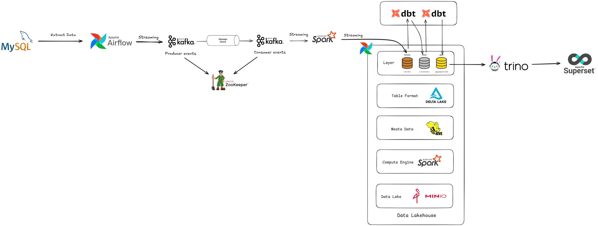

# Chinook Data Lakehouse

## Introduction

This project implements a **Lakehouse-based data pipeline** using the **Chinook dataset**, a digital music store database that includes information about tracks, albums, artists, customers, and invoices. The architecture is designed following the modern **Delta Lakehouse** pattern, supporting both batch and streaming workloads with scalable open-source tools.

- Extracted data from the **Chinook MySQL** database using **Apache Airflow**, then published structured events to **Apache Kafka** for reliable streaming ingestion
- Consumed Kafka events using **Apache Spark Structured Streaming**, writing to **Delta Tables** stored in **MinIO** (object storage)
- Organized the Delta Tables into **bronze**, **silver**, and **gold** layers representing raw, cleaned, and aggregated data respectively
- Modeled and transformed data using **dbt**, generating analytical tables for business intelligence and machine learning
- Queried Delta Tables using **Trino**, and visualized results through **Apache Superset** dashboards

This end-to-end project demonstrates a modular, fault-tolerant, and scalable data platform for modern data engineering use cases.

---

## Architecture



---

## Tech Stack

| Layer                | Technology                      |
|---------------------|----------------------------------|
| Data Source         | MySQL (Chinook Database)         |
| Orchestration       | Apache Airflow                   |
| Messaging Queue     | Apache Kafka + Apache Zookeeper  |
| Stream Processing   | Apache Spark Structured Streaming|
| Data Lake Storage   | MinIO (S3-compatible)            |
| Table Format        | Delta Lake                       |
| Metadata Store      | Apache Hive Metastore            |
| Transformation Tool | dbt (Data Build Tool)            |
| Query Engine        | Trino                            |
| Dashboard           | Apache Superset                  |
| Programming Language| Python                           |

---

## Directory Structure

```bash
chinook-lakehouse/
├── dags/
├── scripts/
├── spark/
├── dbt/
├── minio/
├── superset/
├── data/
├── assets/
├── docker-compose.yml
├── notebooks/
└── README.md
```

## Authors

- **Hung Nguyen** – [@hungfnguyen](https://github.com/hungfnguyen)
