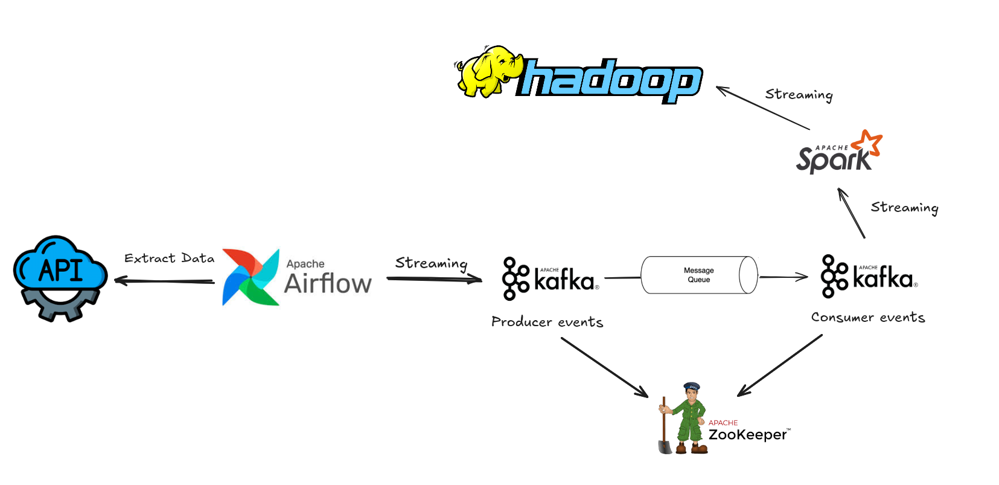

# 🌀 API Data Ingestion with Kafka & Spark Streaming

This project demonstrates a real-time data ingestion pipeline using **Apache Kafka**, **Apache Spark Streaming**, and **Apache Airflow**. The data is extracted from a public **API**, sent to Kafka, then processed by Spark Streaming, and finally stored in **Hadoop HDFS**.

## 🧱 Architecture



## 🛠 Tech Stack

| Component | Technology |
|----------|-------------|
| Workflow Orchestration | Apache Airflow |
| Messaging | Apache Kafka |
| Streaming Consumer | Apache Spark |
| Coordination | Apache Zookeeper |
| Storage | Hadoop HDFS |
| Language | Python (Producer) |

---

## 📁 Directory Structure

```bash
api-ingestion/
├── airflow_dags/
│   └── api_to_kafka_dag.py
├── kafka_producer/
│   └── producer.py
├── spark_streaming/
│   └── spark_kafka_consumer.py
├── docker-compose.yml
├── data/
│   └── output/ (saved HDFS results)
└── README.md
```

## 📌 Authors

- **Hung Nguyen** – [@hungfnguyen](https://github.com/hungfnguyen)
