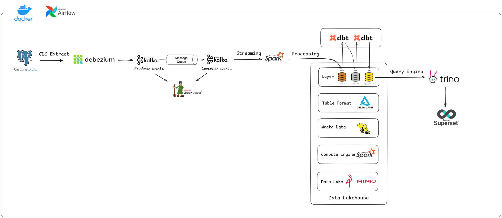

# Pagila Data Lakehouse

## Introduction

This project implements a **Lakehouse-based data platform** using the **Pagila dataset** – a sample PostgreSQL database that simulates a DVD rental store. The architecture is designed to support both **streaming and batch data processing** following the **modern Lakehouse pattern**, with clearly separated **bronze, silver, and gold layers**.

* Captures real-time changes from **PostgreSQL (Pagila)** using **Debezium** and ingests into **Apache Kafka**
* Processes streaming data with **Apache Spark Structured Streaming**, writing Delta Lake tables to **MinIO** object storage
* Organizes data into **bronze (raw)**, **silver (cleaned)**, and **gold (aggregated)** layers following the **medallion architecture**
* Transforms data using **dbt** running on Spark to model tables for analytics and reporting
* Manages metadata using **Apache Hive Metastore**
* Enables fast SQL queries through **Trino**
* Visualizes insights and dashboards using **Apache Superset**
* All components are containerized using **Docker** and orchestrated via **Apache Airflow**

This project showcases an end-to-end open-source solution for building a scalable, modular, and real-time data lakehouse system.

---

## Architecture

---

## Tech Stack

| Layer                | Technology                        |
| -------------------- | --------------------------------- |
| Data Source          | PostgreSQL (Pagila Database)      |
| CDC Tool             | Debezium                          |
| Orchestration        | Apache Airflow                    |
| Messaging Queue      | Apache Kafka + Zookeeper          |
| Stream Processing    | Apache Spark Structured Streaming |
| Data Lake Storage    | MinIO (S3-compatible)             |
| Table Format         | Delta Lake                        |
| Metadata Store       | Apache Hive Metastore             |
| Transformation Tool  | dbt (with Spark as backend)       |
| Query Engine         | Trino                             |
| Dashboard            | Apache Superset                   |
| Containerization     | Docker                            |
| Programming Language | Python                            |

---

## Author

* **Hung Nguyen** – [@hungfnguyen](https://github.com/hungfnguyen)
